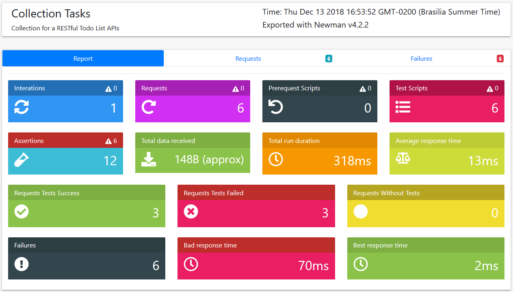

# Node.js RESTful

Just a simple project to demonstrated how to create RESTful API with Node.js and test it with
Postman collections with newman

## How to start

First you need to have Node.js installed in your machine and than run the commands below:

- `npm install`

- `npm start`

## How to run the automated tests

- `npm test`

## Test Reports

You can find the automated tests reports under folder ```newman```



## References

- [Postman for QA Teams](https://www.getpostman.com/qa)
- [Awesome newman HTML template](https://github.com/MarcosEllys/awesome-newman-html-template)
